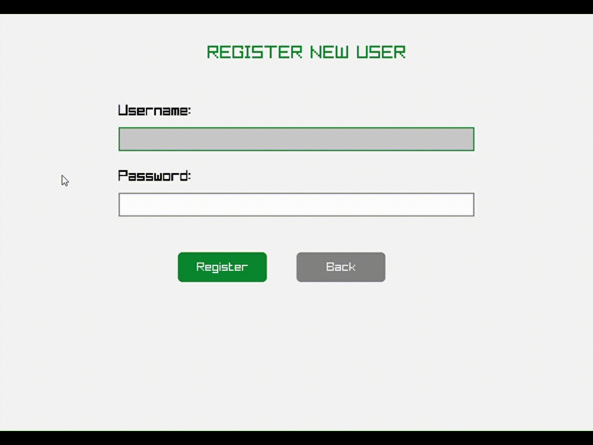
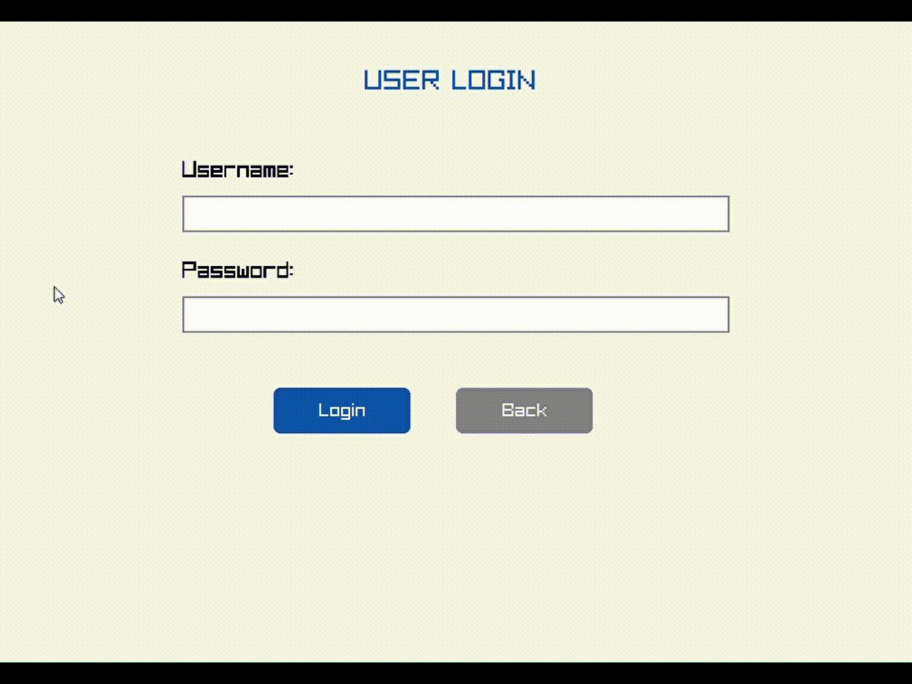
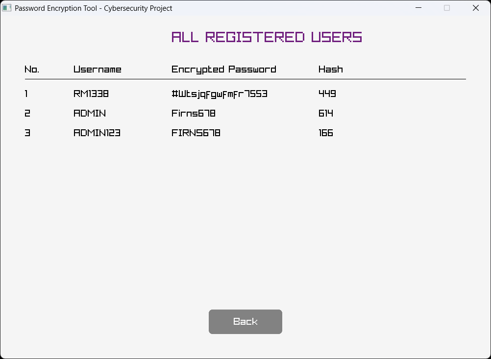
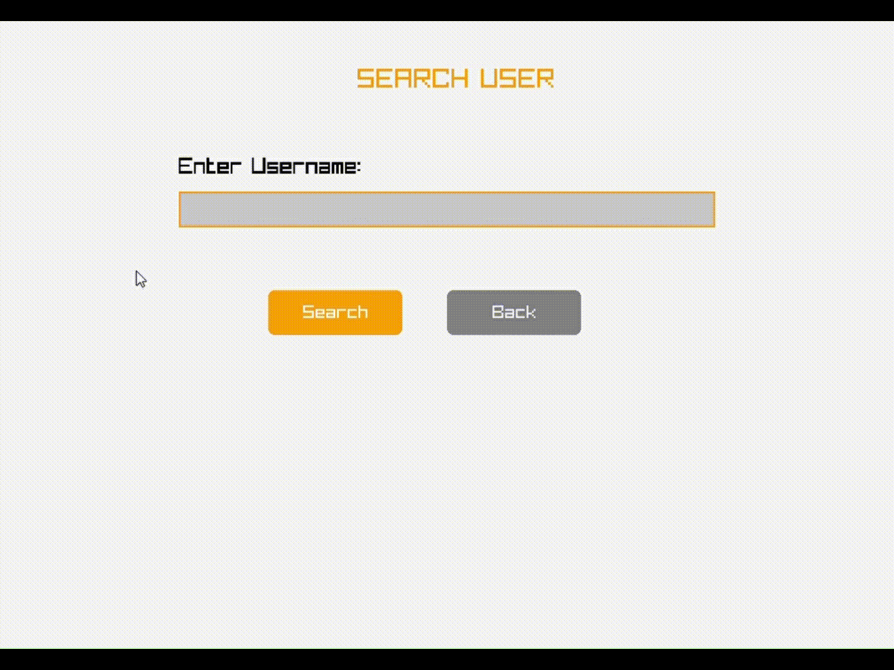
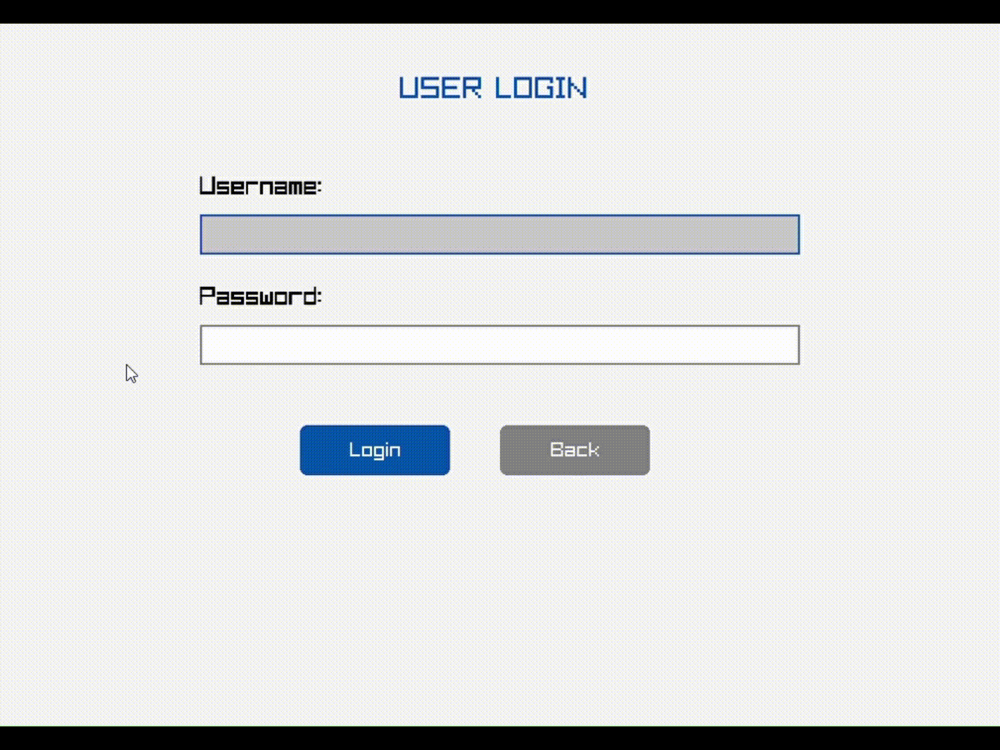

# 🔐 PassGuard - Local Password Manager


<div align="center">
  


**A local password management application designed for learning and educational purposes with Caesar cipher encryption and interactive GUI.**

[Features](#-features) • [Demo](#-demo) • [Installation](#-installation) • [Tech Stack](#-tech-stack) • [Project Structure](#-project-structure)

---

</div>

## 📸 Demo

<div align="center">

### Main Menu
  


---

### User Registration



*Register new users with validated usernames and encrypted passwords*

---

### User Login



*Secure authentication with encrypted password verification*

---

### View Users



*Display all registered users with their encrypted information*

---

### Search Users



*Quickly find specific users with the search functionality*

---

### Error Handling



*Real-time validation and user-friendly error messages*

---

### Save & Load Users


*Persistent storage with automatic save and load functionality*

</div>

## ✨ Features

### 🔒 Security Features
- **Caesar Cipher Encryption** - All passwords encrypted using Caesar cipher algorithm
- **Secure Authentication** - Login verification with encrypted password matching
- **Input Validation** - Enforces minimum password length and prevents invalid entries
- **Local Storage Only** - All data stored locally for maximum privacy

### 👤 User Management
- **User Registration** - Create accounts with username and password
- **User Login** - Secure authentication system
- **View All Users** - Display complete user database
- **Search Users** - Quick search by username
- **Sort Users** - Organize users alphabetically
- **Persistent Storage** - Data saved in `users.dat` file

### 🎨 Interactive GUI
- **Clean Interface** - User-friendly graphical interface powered by Raylib
- **Real-time Feedback** - Status and error messages for all actions
- **Responsive Design** - Smooth transitions and button interactions
- **Visual Feedback** - Color-coded messages (success/error)

### 📊 Additional Features
- **Automatic Save/Load** - Data persistence between sessions
- **Error Handling** - Comprehensive error checking and user feedback
- **Multiple Actions** - Register, login, view, search, and sort operations
- **Educational Focus** - Built for learning encryption and C programming concepts

## 🚀 Tech Stack

- **C (ISO C99)** - Core programming language
- **Raylib** - Lightweight graphics library for GUI
- **Standard C File I/O** - File operations for data persistence
- **GCC/Clang** - Compiler support
- **Caesar Cipher** - Encryption algorithm implementation

## ⚡ Getting Started

### Prerequisites
- **C Compiler** (GCC, Clang, or MSVC)
- **Raylib** (version 4.0 or higher)
- **Make** (optional)

### Installation

#### Linux/macOS

```bash
# Clone the repository
git clone https://github.com/RM1338/PassGuard.git
cd PassGuard

# Install Raylib (if not already installed)
# On Ubuntu/Debian:
sudo apt-get install libraylib-dev

# On macOS (using Homebrew):
brew install raylib

# Compile
gcc passguard.c -o passguard -lraylib -lm

# Run
./passguard
```

#### Windows

```bash
# Clone the repository
git clone https://github.com/RM1338/PassGuard.git
cd PassGuard

# Compile (using MinGW)
gcc passguard.c -o passguard.exe -lraylib -lopengl32 -lgdi32 -lwinmm

# Run
passguard.exe
```

#### Using Make (Optional)

```bash
# If Makefile is available
make

# Run
./passguard
```

### Download Pre-built Binary
Check the [Releases](https://github.com/RM1338/PassGuard/releases) page for pre-compiled executables.

## 📁 Project Structure

```
PassGuard/
├── .vscode/
│   └── launch.json              # VS Code debug configuration
├── githubAssets/                # Demo images and GIFs
│   ├── banner.jpg               # Project banner
│   ├── Main Menu.png            # Main menu screenshot
│   ├── userRegistration.gif    # Registration demo
│   ├── userLogin.gif            # Login demo
│   ├── viewUsers.png            # View users screenshot
│   ├── searchUsers.gif          # Search demo
│   ├── errorMessage.gif         # Error handling demo
│   └── loadsaveUsers.gif        # Save/Load demo
├── Project Documentation/
│   └── URK25CS1106 - (CodeGen PPS Micro Project PPT).pdf
├── passguard.c                  # Main source code
├── passguard.exe                # Compiled executable (Windows)
├── users.dat                    # User data file (auto-generated)
└── README.md                    # This file
```

## 🎯 How It Works

### Caesar Cipher Encryption
```c
// Encryption function
char encryptChar(char ch, int key) {
    if (isalpha(ch)) {
        char base = isupper(ch) ? 'A' : 'a';
        return (ch - base + key) % 26 + base;
    }
    return ch;
}
```

### User Registration Flow
1. Enter username (validated for uniqueness)
2. Enter password (minimum 6 characters)
3. Password encrypted using Caesar cipher
4. User data saved to `users.dat`
5. Success message displayed

### Authentication Process
1. Enter username
2. Enter password
3. Password encrypted and compared with stored hash
4. Access granted/denied based on match

## 🎨 Customization

### Changing Encryption Key
Edit the encryption key constant in `passguard.c`:
```c
#define ENCRYPTION_KEY 5  // Change to any integer value
```

### Modifying Password Requirements
```c
#define MIN_PASSWORD_LENGTH 6  // Minimum password length
#define MAX_PASSWORD_LENGTH 20 // Maximum password length
```

### UI Customization
Modify colors and UI elements in the Raylib drawing functions:
```c
#define PRIMARY_COLOR RAYWHITE
#define SECONDARY_COLOR DARKBLUE
#define SUCCESS_COLOR GREEN
#define ERROR_COLOR RED
```

### Adding Features
The modular code structure makes it easy to add:
- Password strength checker
- Multiple encryption algorithms
- Export/import functionality
- User profile pictures
- Password reset functionality

## 🔧 Troubleshooting

### Common Issues

**Raylib not found:**
```bash
# Make sure Raylib is installed
pkg-config --libs raylib
```

**Compilation errors:**
```bash
# Try specifying full paths to libraries
gcc passguard.c -o passguard -I/usr/include/raylib -L/usr/lib -lraylib -lm
```

**users.dat permission denied:**
```bash
# Check file permissions
chmod 644 users.dat
```

## 🐛 Known Issues

- Caesar cipher is for educational purposes only (not cryptographically secure)
- Maximum 100 users supported in current implementation
- No password recovery mechanism (by design for learning purposes)
- GUI may not scale properly on very high DPI displays

## 🚀 Future Enhancements

- [ ] Database integration (SQLite, MySQL)
- [ ] Advanced encryption (AES, bcrypt, Argon2)
- [ ] Password strength meter
- [ ] Password generator
- [ ] Multi-factor authentication
- [ ] Session management
- [ ] Export/import functionality
- [ ] User authorization levels
- [ ] Activity logging
- [ ] Email notifications
- [ ] Web-based interface
- [ ] Mobile app version
- [ ] Cloud synchronization
- [ ] Browser extension integration

## 📚 Learning Outcomes

This project teaches:
- **C Programming** - File I/O, structs, functions
- **Encryption Basics** - Caesar cipher implementation
- **GUI Development** - Raylib library usage
- **Data Persistence** - File-based storage
- **Input Validation** - User input sanitization
- **Software Design** - Modular code structure

## 🤝 Contributing

Currently not accepting contributions (college project). Feel free to fork and experiment!

## 📝 License

This project is licensed under the **MIT License** - see the [LICENSE](LICENSE) file for details.

## ⚠️ Security Notice

**Important:** This project uses Caesar cipher encryption for **educational purposes only**. Caesar cipher is NOT cryptographically secure and should NEVER be used for real password management. For production applications, use industry-standard encryption like AES-256, bcrypt, or Argon2.

## 🙏 Acknowledgments

- **Raylib** - Amazing graphics library by [Ramon Santamaria](https://github.com/raysan5)
- **Karunya Institute of Technology and Sciences** - Academic support
- **CodeGen Team** - Collaborative development and testing
- **C Programming Community** - Documentation and resources

## 👥 Team

- **Ronel Abraham Mathew** - Lead Developer  
  GitHub: [RM1338](https://github.com/RM1338)  
  LinkedIn: [Ronel Abraham Mathew](https://linkedin.com/in/ronelm)

- **Joshua Sibichan Scariya** - Developer  
  GitHub: [BuildwJoshh](https://github.com/BuildwJoshh)  
  LinkedIn: [Joshua Sibichan Scariya](https://www.linkedin.com/in/joshua-sibichan-scariya-141488380/)

- **Aditi Lakshmanan** - Developer  
  GitHub: [Aditi-Lakshmanan](https://github.com/Aditi-Lakshmanan)  
  LinkedIn: [Aditi Lakshmanan](https://www.linkedin.com/in/aditi-lakshmanan-a60696288/)

- **Yogesh** - Developer  
  GitHub: [Yogesh](https://github.com/)  
  LinkedIn: [Yogesh](https://linkedin.com/in/)

## 📧 Contact

**Ronel Abraham Mathew**  
Email: rma80070@gmail.com  
GitHub: [RM1338](https://github.com/RM1338)  
LinkedIn: [Ronel Abraham Mathew](https://linkedin.com/in/ronelm)

**Project Link:** [https://github.com/RM1338/PassGuard](https://github.com/RM1338/PassGuard)

---

<div align="center">
  
Made with ❤️ by the CodeGen Team

If you found this project helpful, consider giving it a ⭐!

**Built for Learning | Not for Production Use**

</div>